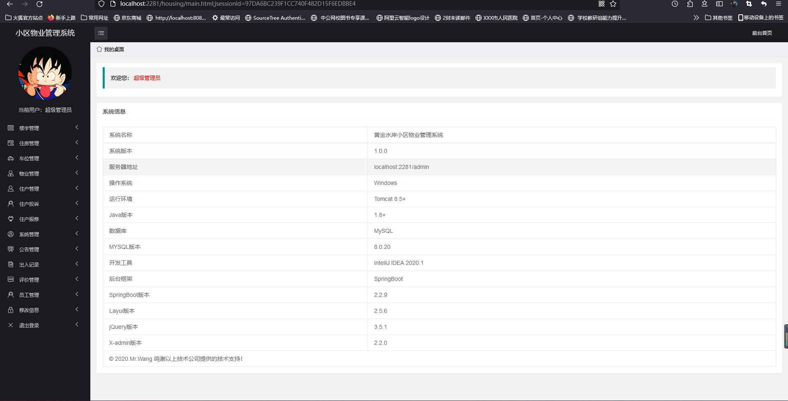
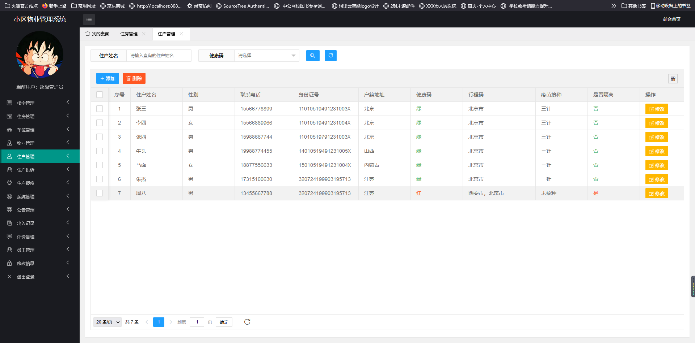
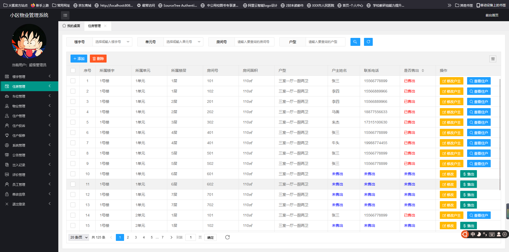
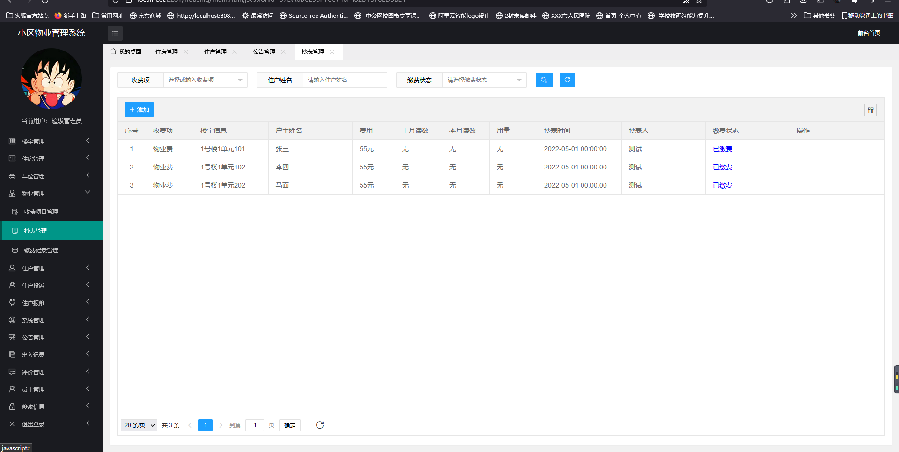
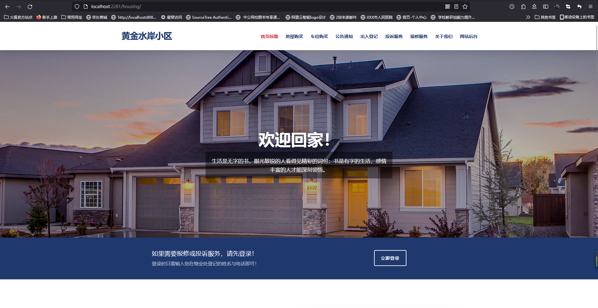
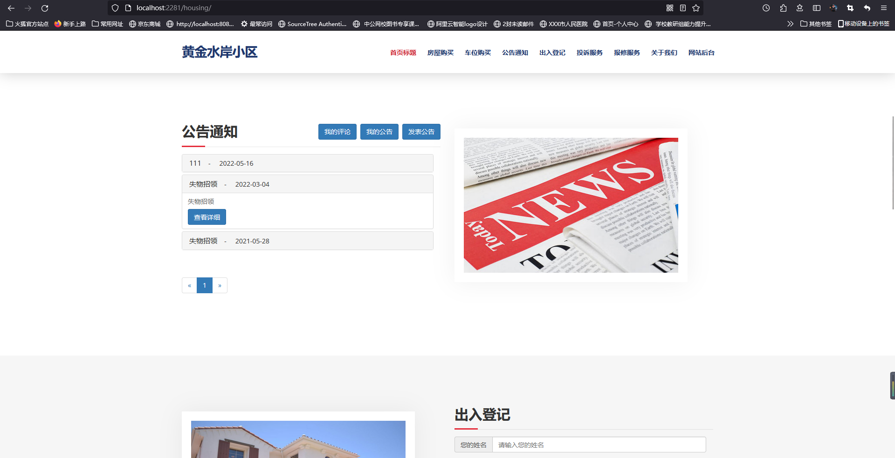
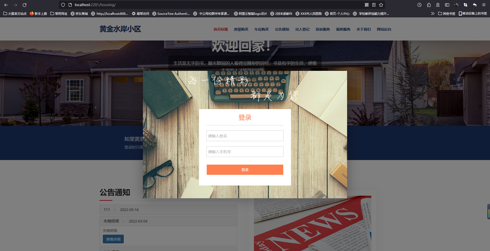
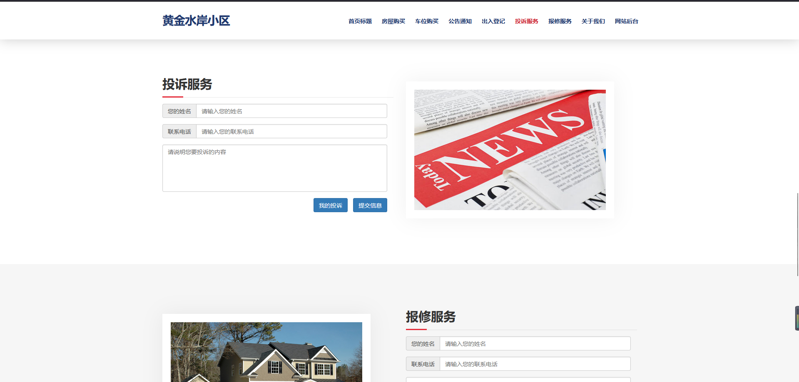

# 基于SpringBoot的小区物业系统


#### 

#### 介绍

随着社会经济的飞速发展，有越来越多的人从农村搬到了城市，市区的人口骤然增多。我国市区的人口越来越多，所以物业的发展速度飞快，这也就意味着整个小区有庞大的工作要处理，比如说有很多小区业主信息要录入操作，每户业主也要缴纳物业费，有些小区的问题业主要投诉并且得到反馈等。小区的业主和物业公司在很多时候都有很多管理方面的矛盾需要去调节，这时候如果有一个物业管理系统去代替传统的人工方式去管理整个小区将大大地缓解了物业管理这方面的压力。

```
本系统后台系统主要使用Java语言
整体架构采用：SpringBoot + MyBatis + MySQL数据库。
```


#### 系统技术栈

SpringBoot + MyBatis + Thymeleaf + Layui +  jQuery + JavaScript +  MySQL 

#### 非免费开源

#### 需要加Q：943701114，可供学生毕设参考使用，再次强调，非免费开源，非诚勿扰

#### 项目视频地址

https://www.bilibili.com/video/BV15B4y1978u?spm_id_from=333.999.0.0

#### 项目截图

##### 管理员端截图

|  |      |
| --------------------------------------------------- | ------------------------------------------------ |
|      |  |


##### 用户端截图

|  |  |
| --------------------------------------------- | ---------------------------------------------- |
|  |   |


#### 参与贡献

1.  斗佛

